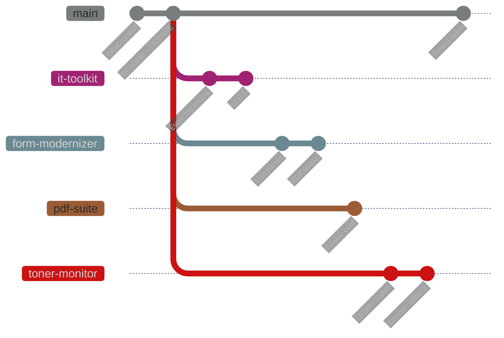

<!--
  Personal-AI-Projects — README v2
  Created by Redfox using Claude
-->

<div align="center">


<br /><br />

<!-- ── Core stack ─────────────────────────────── -->


<br />

<!-- ── Live repo telemetry ────────────────────── -->


<br /><br />

<a href="#-project-index"></a>
<a href="#-branch-strategy"></a>
<a href="#-getting-started"></a>

</div>


## 🧭 Overview

> **A collection of personal AI-assisted projects built to automate tasks, improve productivity and support both professional and personal activities.**

Every tool here started as a real friction point in day-to-day hospitality IT operations — a manual check repeated 24 times, a form nobody could edit, a report someone typed by hand every Monday — and ended up as a small, self-contained application.

<div align="center">

| 🎯 Principle | What it means in practice |
| :--- | :--- |
| **Offline first** | No external API dependency where a rule-based approach will do |
| **Safe by default** | Read-only operations unless explicitly told otherwise |
| **Single-file deploy** | A `.bat` launcher and a folder — no installers, no admin rights |
| **Documented** | Every branch ships its own README, requirements and screenshots |

</div>


## 🌿 Branch Strategy

Rather than scattering work across repositories, **each project lives in its own dedicated branch**. One repository, independent lifecycles.



<div align="center">

| Branch | Role | Contents |
| :--- | :--- | :--- |
| `main` | 🏛️ **Hub** | Overview, documentation, project index |
| `it-toolkit` | 🔧 Project | Windows diagnostics suite |
| `form-modernizer` | 📄 Project | Legacy Excel/VBA → fillable PDF |
| `pdf-suite` | 📚 Project | Fillable PDFs + document comparison |
| `toner-monitor` | 🖨️ Project | HP printer supply monitoring |

</div>


## 📦 Project Index

<table>
<tr>
<td width="50%" valign="top">

### 🔧 IT Toolkit


Desktop suite for daily IT work. Reads and interprets Windows event logs, detects errors and potential issues, **suggests fixes**, and compiles them into a report.

`Python` · `CustomTkinter` · `WMI`

<details>
<summary><b>Modules</b></summary>

- Dashboard
- Event log analysis + remediation hints
- Network tools
- Quick tools
- Disks
- Services
- Inventory / system info
- Reporting centre

</details>

</td>
<td width="50%" valign="top">

### 📄 FormModernizer


Converts legacy Excel forms carrying VBA macros into modern **fillable PDF or Word** documents, preserving — or improving — the original automations.

`Python` · `openpyxl` · `pypdf`

<details>
<summary><b>Why rule-based?</b></summary>

VBA is parsed and translated offline with a deterministic rule engine. No AI API call, no data leaving the machine — a hard requirement for corporate forms.

</details>

</td>
</tr>
<tr>
<td width="50%" valign="top">

### 📚 PDF Suite


Two tools, one interface: turn any PDF into a fillable form, and compare or summarise multiple documents — supplier proposals, reports, contracts — into a single detailed verdict.

`Python` · `PDF` · `DOCX`

<details>
<summary><b>Remaining work</b></summary>

- [ ] Graphical interface
- [ ] Report generation
- [ ] Test coverage
- [ ] Packaging

</details>

</td>
<td width="50%" valign="top">

### 🖨️ HP Toner Monitor


Queries the embedded web server of every HP printer on the fleet, flags any toner **below 15%**, identifies colour and cartridge reference, archives the usage page as PDF and drafts the reorder e-mail.

`Python` · `SNMP` · `Selenium`

<details>
<summary><b>Collection chain</b></summary>

`LEDM` → `SNMP` → `HTML scrape` → `browser fallback`

Each method falls through to the next, so a proxy or a self-signed certificate warning never stops the run.

</details>

</td>
</tr>
</table>


## ⚡ Getting Started

<details open>
<summary><b>Clone a single project branch</b></summary>

```bash
git clone --branch <branch-name> --single-branch \
  https://github.com/RafaDevpt/Personal-AI-Projects.git
```

</details>

<details>
<summary><b>Clone everything and switch locally</b></summary>

```bash
git clone https://github.com/RafaDevpt/Personal-AI-Projects.git
cd Personal-AI-Projects
git branch -a
git checkout <branch-name>
```

</details>

<details>
<summary><b>Requirements</b></summary>

| Requirement | Version |
| :--- | :--- |
| Windows | 10 / 11 |
| Python | 3.11+ |
| Dependencies | per project, see `requirements.txt` in each branch |

```bash
python -m venv .venv
.venv\Scripts\activate
pip install -r requirements.txt
```

</details>


## 👤 About

<table>
<tr>
<td valign="top" width="60%">

Built and maintained by **Rafael Santos** — IT Manager in luxury hospitality, working across PMS, POS, networking and compliance, with a habit of turning manual operations into tooling.

These projects are personal work, published under GPL-3.0 so anyone facing the same problems can reuse them.

<br />

[](https://www.linkedin.com/in/)
[](https://github.com/RafaDevpt)

</td>
<td valign="top" width="40%">

**Working with**


**Focus**

`Automation` · `IT operations`
`Systems integration` · `Compliance`

</td>
</tr>
</table>


<div align="center">

## 📜 License

Distributed under the **GNU General Public License v3.0** — see [`LICENSE`](LICENSE).

<br />

<sub>Created by Redfox using Claude</sub>


</div>
