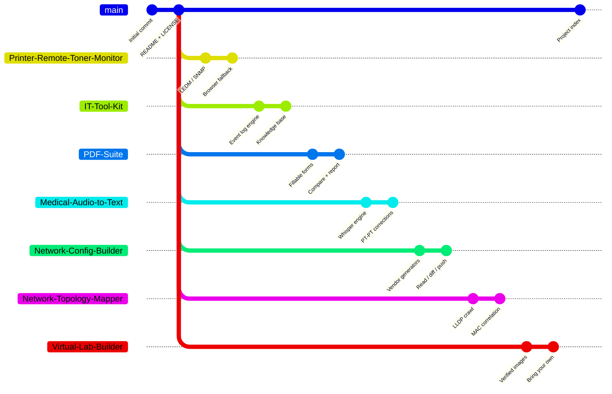

<!--
  PT-PT: Personal-AI-Projects — README do hub.
         O `main` não contém código de aplicação: é o índice. Cada projeto vive
         no seu próprio branch, com o seu README, os seus requisitos e o seu
         ciclo de vida. A tabela de branches abaixo tem de corresponder
         exactamente a `git branch -r` — se divergir, o Quick Start deixa de
         funcionar para quem clonar.

  EN-UK: Personal-AI-Projects — hub README.
         `main` carries no application code: it is the index. Each project
         lives in its own branch with its own README, requirements and
         lifecycle. The branch table below must match `git branch -r` exactly —
         if it drifts, the Quick Start stops working for anyone cloning.

  Created by Redfox using Claude
-->

<div align="center">



<br /><br />

<!-- ── Core stack ─────────────────────────────── -->


<br />

<!-- ── Live repo telemetry ────────────────────── -->


<br /><br />

<a href="#-project-index"></a>
<a href="#-branch-strategy"></a>
<a href="#-getting-started"></a>

</div>


## 🧭 Overview

> **A collection of personal AI-assisted projects built to automate tasks, improve productivity and support both professional and personal activities.**

Every tool here started as a real friction point in day-to-day hospitality IT operations — a manual check repeated 24 times, a form nobody could edit, a report someone typed by hand every Monday — and ended up as a small, self-contained application.

<div align="center">

| 🎯 Principle | What it means in practice |
| :--- | :--- |
| **Offline first** | No external API dependency where a rule-based approach will do.<sup>[1](#nota-offline)</sup> |
| **Safe by default** | Read-only operations unless explicitly told otherwise |
| **Single-file deploy** | A launcher and a folder — no installers, no admin rights |
| **Three versions, one per system** | Every project ships `Windows/`, `Linux/` and `macOS/` folders — each a complete, self-contained application with its own `src/`, tests and launcher. No operating-system branching inside any of them: a test in each version fails if somebody adds one<sup>[3](#nota-tres)</sup> |
| **Documented** | Every branch ships its own README, requirements and screenshots |
| **Bilingual source** | Every module, class and function documented in PT-PT and EN-UK |

</div>

<a name="nota-offline"></a>
<sub>

**[1]** One deliberate exception: the **PDF Suite** carries an optional model-assisted analysis that sends document text to the Anthropic API. It is **disabled by default**, it states how many documents and characters will leave the machine before sending anything, and everything it returns is labelled as coming from the model. Every other feature of every project runs entirely offline.

*Uma excepção deliberada: a análise assistida do PDF Suite. Está desligada por omissão, avisa antes de enviar, e o que devolve vem sempre identificado como vindo do modelo.*

</sub>


## 🌿 Branch Strategy

Rather than scattering work across repositories, **each project lives in its own dedicated branch**. One repository, independent lifecycles. `main` holds only the index, the licence and the header asset.



<div align="center">

| Branch | Role | Contents | Runs on |
| :--- | :--- | :--- | :--- |
| `main` | 🏛️ **Hub** | Overview, documentation, project index | — |
| `IT-Tool-Kit` | 🔧 Project | Machine diagnostics suite | Windows · Linux · macOS<sup>[2](#nota-windows)</sup> |
| `PDF-Suite` | 📚 Project | Fillable PDFs + document comparison | Windows · Linux · macOS |
| `Printer-Remote-Toner-Monitor` | 🖨️ Project | HP printer supply monitoring | Windows · Linux · macOS |
| `Medical-Audio-to-Text` | 🩺 Project | Offline PT-PT medical dictation | Windows · Linux · macOS |
| `Network-Config-Builder` | 🌐 Project | Switch configuration for Aruba, Cisco and Ubiquiti | Windows · Linux · macOS |
| `Network-Topology-Mapper` | 🗺️ Project | Walks the network and maps what is on every port | Windows · Linux · macOS |
| `Virtual-Lab-Builder` | 🧪 Project | Builds virtual machines from verified official images | Windows · Linux · macOS |

</div>

<a name="nota-tres"></a>
<sub>

**[3]** The cost is stated up front in every project: **a fix to shared code has to be applied three times.** That is the price of three independent versions rather than one with branches, and it is a deliberate choice — each version reads more simply, carries no code that does not concern it, and a user takes to their machine only what they need. Each project's `CONTRIBUTING.md` carries the `diff` command that confirms the three have not drifted apart.

How much is actually shared varies by project, and the IT Toolkit is the extreme case: there, the three versions share the report format and the module layout and almost nothing else, because reading a Windows event log and reading a systemd journal are not the same job written twice.

CI runs every version on its own native runner — `windows-latest`, `ubuntu-latest`, `macos-latest`. A Linux version tested on a Windows runner proves nothing about what it does on Linux.

</sub>

<a name="nota-windows"></a>
<sub>

**[2]** The IT Toolkit used to be Windows-only, and its `Linux/` and `macOS/` folders held an explanation of why: reading Windows event logs through `wevtutil`, inventory through WMI and SMART through `wmic` is not something you port — porting it would mean writing a different application that does the same job elsewhere.

That explanation was right, and in v4.0.0 the other two applications were written. The Linux version reads the systemd journal, `/proc`, `/sys` and `systemctl`; the macOS version reads the unified log, the crash reports in `DiagnosticReports`, `launchd` and `diskutil`. They share the report format, the eight modules and the shape of the knowledge base — and, unlike the sibling projects, very little code, because there is very little that could honestly be shared.

Each also knows what it *cannot* see, and says so: elevation on Windows, the `systemd-journal` group on Linux, Full Disk Access on macOS. On all three the command runs, returns zero and shows less — and a report that fails to flag that looks like a clean machine.

</sub>


## 📦 Project Index

<table>
<tr>
<td width="50%" valign="top">

### 🔧 IT Toolkit


Desktop suite for daily IT work. Reads and interprets the system's event record — event logs on Windows, the systemd journal on Linux, the unified log on macOS — detects errors and potential issues, **suggests fixes**, and compiles them into a report.

`Python` · `CustomTkinter` · `WMI` · `systemd` · `launchd`

<details>
<summary><b>Modules</b></summary>

- Dashboard
- Event log analysis + remediation hints
- Network tools
- Quick tools
- Disks
- Services
- Inventory / system info
- Reporting centre

</details>

</td>
<td width="50%" valign="top">

### 📚 PDF Suite


Two tools, one interface: turn any PDF into a fillable form, and compare or summarise multiple documents — supplier proposals, reports, contracts — into a single detailed verdict.

`Python` · `pdfplumber` · `pypdf` · `reportlab`

<details>
<summary><b>What it refuses to do</b></summary>

- **Does not invent missing values.** A quote with no stated warranty is not worth zero — it is "does not say", and the criterion is dropped with its weight redistributed.
- **Does not declare a winner on a thin margin.** Below five points in a hundred it says there is no clear winner.
- **Does not convert currencies.** Different currencies means a warning, not a comparison.

</details>

</td>
</tr>
<tr>
<td width="50%" valign="top">

### 🖨️ HP Toner Monitor


Queries the embedded web server of every HP printer on the fleet, flags any toner **below 15%**, identifies colour and cartridge reference, archives the usage page as PDF and drafts the reorder e-mail.

`Python` · `SNMP` · `Selenium`

<details>
<summary><b>Collection chain</b></summary>

`LEDM` → `SNMP` → `HTML scrape` → `browser fallback`

Each method falls through to the next, so a proxy or a self-signed certificate warning never stops the run.

It **drafts** the order e-mail as an `.eml` and never sends it: quantities depend on the stock already in the store room, which the tool knows nothing about.

</details>

</td>
<td width="50%" valign="top">

### 🩺 Transcritor Médico PT


Turns dictated audio into written text in **European Portuguese**, with a correction layer built for clinical vocabulary — drug names, dosages, abbreviations and units that a general-purpose transcriber gets wrong.

`Python` · `Whisper` · `CustomTkinter`

<details>
<summary><b>Why it runs offline</b></summary>

The audio is clinical. It never leaves the machine: transcription and correction both run locally, with no API call and no upload step anywhere in the pipeline.

</details>

</td>
</tr>
<tr>
<td width="50%" valign="top">

### 🌐 Network Config Builder


Describe a switch once — VLANs, ports, services, hardening — and it writes the configuration file in **Aruba AOS-CX**, **Cisco IOS**, **Ubiquiti EdgeSwitch** or **UniFi** syntax. Then reads what is running on the device, diffs it, and pushes.

`Python` · `Netmiko` · `CustomTkinter`

<details>
<summary><b>Safe by default</b></summary>

- **Reads before it writes.** The backup is the entry condition for a push, not an extra. If the read fails, nothing is sent.
- **Simulates by default.** Writing for real needs `--confirmar`, or typing the device's name into the confirmation box.
- **Never writes a password.** Generated files carry a placeholder; credentials live in memory for the session only.
- On **UniFi** the configuration belongs to the controller, so those files carry a warning and no `write memory` — the tool says so rather than pretending otherwise.

</details>

</td>
<td width="50%" valign="top">

### 🗺️ Network Topology Mapper


Give it one core switch — or a UniFi controller — and it walks the network on its own, neighbour to neighbour, reading MAC tables, ARP, port state and PoE. Produces the thing nobody has: **every device, which switch and port it is on, and what it appears to be**.

`Python` · `Netmiko` · `LLDP / CDP` · `reportlab`

<details>
<summary><b>How it decides what something is</b></summary>

Every classification carries a **confidence level and the signals behind it**. An AP identified by LLDP is a fact; a "workstation" inferred from an Intel OUI is a fair guess that could be a printer.

When signals disagree, confidence drops and the conflict is recorded — HP makes workstations and printers under the same OUI, and answering "workstation" would be right half the time.

The finding that earns its keep: a port with six MACs and no LLDP neighbour has an **unmanaged switch** on the far side. It explains the loops and the socket that "sometimes drops".

</details>

</td>
</tr>
<tr>
<td width="50%" valign="top">

### 🧪 Laboratório Virtual


Builds virtual machines without the two things that go wrong. It fetches the image from the project's **own** servers with the whole verification chain along the way, and works out the specification from what the host actually has — then says **how** it got to the numbers, so you know when to change them.

It **recognises the hypervisor you already paid for** — VMware Workstation, Parallels Desktop, VMware Fusion — and knows how to build machines in it. When none is present, it installs one for you, silently, with the progress on screen. Seventeen images in the catalogue, or bring your own.

`PowerShell` · `bash` · `GPG` · `libvirt` · `QEMU`

<details>
<summary><b>Why the order of the checks matters more than the checks</b></summary>

Domain allowlist re-checked **on every redirect** — following redirects blindly voids the list entirely. HTTPS with no exceptions. GPG signature of the checksum manifest. SHA-256, mandatory, with no off switch.

And the signature is verified **before** the filename is read out of the manifest. The other way round, a tampered manifest could point at anything — and the final checksum would happily confirm that anything matched the value the attacker put there.

**The filename is never invented.** It comes out of the signed manifest, because a name pinned in a catalogue goes stale on the first point release — and a wrong name is indistinguishable from an attack.

The report always says which layers ran. A layer that did not appears as `[--]` rather than being left off: saying "verified" when only a same-channel checksum was compared is a misleading truth.

</details>

<details>
<summary><b>Bring your own image</b></summary>

For a Proxmox, a TrueNAS, an appliance, or the ISO your company hands you. **No guarantees are invented here** — the report shows four layers unapplied and, at best, the checksum.

What it can still do is say **where the file came from**, and each system knows something different: the Mark of the Web on Windows (which often carries the download URL), Gatekeeper's quarantine and `kMDItemWhereFroms` on macOS, `user.xdg.origin.url` on Linux. On all three, no mark means the system does not know — not that the file is safe.

And it knows that **an ISO is the installer while a disk image is the machine**: creating an empty disk beside a `.qcow2` and booting from a CD that is not there gives exactly the *no bootable device* nobody can explain.

</details>

</td>
<td width="50%" valign="top">

&nbsp;

</td>
</tr>
</table>


## ⚡ Getting Started

<details open>
<summary><b>Clone a single project branch</b></summary>

```bash
git clone --branch PDF-Suite --single-branch https://github.com/RafaDevpt/Personal-AI-Projects.git
```

Replace `PDF-Suite` with `IT-Tool-Kit`, `Printer-Remote-Toner-Monitor`, `Medical-Audio-to-Text`, `Network-Config-Builder`, `Network-Topology-Mapper` or `Virtual-Lab-Builder`. Branch names are **case-sensitive**.

</details>

<details>
<summary><b>Clone everything and switch locally</b></summary>

```bash
git clone https://github.com/RafaDevpt/Personal-AI-Projects.git
```

```bash
cd Personal-AI-Projects && git branch -a && git checkout PDF-Suite
```

</details>

<details>
<summary><b>Requirements</b></summary>

| Requirement | Version |
| :--- | :--- |
| Windows | 10 / 11 |
| Linux | any current distribution |
| macOS | 11 (Big Sur) or later |
| Python | 3.10+ |
| Dependencies | per project **and per system**, see `requirements.txt` inside each `Windows/`, `Linux/` or `macOS/` folder |

Pick your system's folder first — each is a complete application:

```bash
cd <Project>/Linux                      # or Windows, or macOS
python -m venv .venv
source .venv/bin/activate               # Windows: .venv\Scripts\activate
pip install -r requirements.txt
```

Every project ships a launcher per system that builds the environment on first run, so the manual steps above are only needed for development:

| System | Launcher |
| :--- | :--- |
| Windows | `EXECUTAR.bat` — double-click |
| Linux | `./executar.sh` |
| macOS | `executar.command` — double-click |

On Linux and macOS, a repository cloned by a Windows machine loses the executable bit: `chmod +x executar.sh cli.sh` restores it.

</details>

<details>
<summary><b>Running the tests</b></summary>

```bash
pip install -r requirements-dev.txt && python -m pytest
```

Each project branch is checked on every push by GitHub Actions — see `.github/workflows/ci.yml` on that branch.

</details>


## 👤 About

<table>
<tr>
<td valign="top" width="60%">

Built and maintained by **Rafael Santos** — IT Manager in luxury hospitality, working across PMS, POS, networking and compliance, with a habit of turning manual operations into tooling.

These projects are personal work, published under the MIT licence so anyone facing the same problems can reuse them.

<br />

[](https://www.linkedin.com/in/rafaelsantosit/)
[](https://github.com/RafaDevpt)

</td>
<td valign="top" width="40%">

**Working with**


**Focus**

`Automation` · `IT operations`
`Systems integration` · `Compliance`

</td>
</tr>
</table>


<div align="center">

## 📜 License

Distributed under the **MIT License** — see [`LICENSE`](LICENSE).

The same licence applies to every project branch, each of which carries its own copy.

<br />

<sub>Created by Redfox using Claude</sub>


</div>
